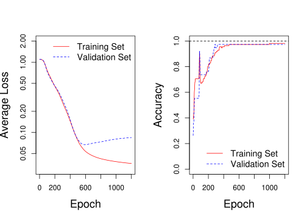

<!-- README.md is generated from README.Rmd. Please edit that file -->

# easy.mlp

<!-- badges: start -->

<!-- badges: end -->

The goal of easy.mlp is to quickly and easily build a neural network to
fit tabular data.

  - Supports the usage of the R `formula` class.
  - Normalizes input and output data to the range of 0-1.
  - One-hot encodes input factor data.
  - Allows for any number of hidden layers and nodes.
  - Supports regression, classification, and binary classification
    networks.
  - Multiple pre-defined activation functions (and supports user-defined
    functions).
  - Mini-batch gradient descent using the ADAM optimizer.
  - Randomly splits data into training and validation data.
  - Simple plotting of metrics and predictions for new data.

## Installation

You can install the released version of easy.mlp from github with:

``` r
library(devtools)

install_github("Greg-Hallenbeck/easy.mlp")
```

## Example

The following code intializes a neural network based on the Fisher Iris
data.

``` r
library(easy.mlp)
#> 
#> Attaching package: 'easy.mlp'
#> The following object is masked from 'package:base':
#> 
#>     tanh

data(iris)
set.seed(8675309)
net <- create.mlp(Species ~ ., data=iris, hidden=c(5,5,5), type="classification")
```

The model then must be trained. This can be repeated multiple times,
each time training for another `n.epochs` epochs.

``` r
n.epochs <- 1200

net <- train(net, n.epochs)
```

Around 1200 epochs, the training and validation loss begin to diverge:

``` r
par(mfrow=c(1,2))
options(repr.plot.width=10, repr.plot.height=5.5)

plot(net, ylim=c(0.03, 2))
plot(net, metric="accuracy", ylim=c(0,1))
```



The `predict()` function makes prediction for the training or validation
data as well as new data. For classification tasks, it can return either
numeric probabilities for each category or labels, as requested.

``` r
predict(net, newdata=iris[1:10,], type="labels")
#>  [1] setosa setosa setosa setosa setosa setosa setosa setosa setosa setosa
#> Levels: setosa versicolor virginica
```
